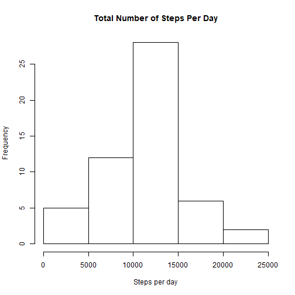
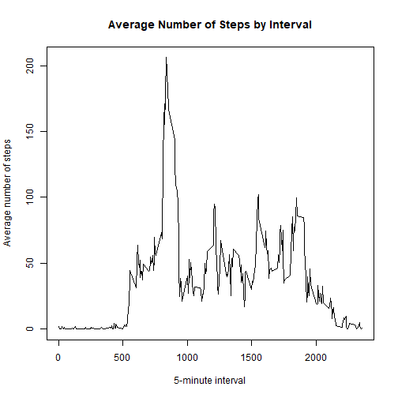
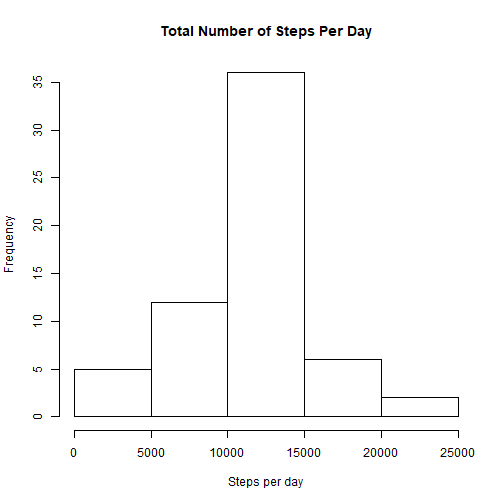

Reproducible Research_Course Project 1
======================================
1. Loading and preprocessing thea data 

```r
activity <- read.csv("activity.csv")
dim(activity)
```

```
## [1] 17568     3
```

```r
head(activity)
```

```
##   steps       date interval
## 1    NA 2012-10-01        0
## 2    NA 2012-10-01        5
## 3    NA 2012-10-01       10
## 4    NA 2012-10-01       15
## 5    NA 2012-10-01       20
## 6    NA 2012-10-01       25
```

```r
str(activity)
```

```
## 'data.frame':	17568 obs. of  3 variables:
##  $ steps   : int  NA NA NA NA NA NA NA NA NA NA ...
##  $ date    : Factor w/ 61 levels "2012-10-01","2012-10-02",..: 1 1 1 1 1 1 1 1 1 1 ...
##  $ interval: int  0 5 10 15 20 25 30 35 40 45 ...
```


2. What is mean total number of steps taken per day? For this part of the assignment, you can ignore the missing values in the dataset.

2.1 Calculate the total number of steps taken per day

```r
steps_per_day <- aggregate(steps~date, activity, sum, rm.na=TRUE)
dim(steps_per_day)
```

```
## [1] 53  2
```

```r
head(steps_per_day)
```

```
##         date steps
## 1 2012-10-02   127
## 2 2012-10-03 11353
## 3 2012-10-04 12117
## 4 2012-10-05 13295
## 5 2012-10-06 15421
## 6 2012-10-07 11016
```

2.2 If you do not understand the difference between a histogram and a barplot, research the difference between them. Make a histogram of the total number of steps taken each day

```r
hist(steps_per_day$steps, main = "Total Number of Steps Per Day", xlab = "Steps per day")
```



2.3 Calculate and report the mean and median of the total number of steps taken per day

```r
mean_steps_per_day <- round(mean(steps_per_day$steps))
median_steps_per_day <- round(median(steps_per_day$steps))

mean_steps_per_day
```

```
## [1] 10767
```

```r
median_steps_per_day
```

```
## [1] 10766
```


3. What is the average daily activity pattern?

3.1 Make a time series plot of the 5-minute interval (x-axis) and the average number of steps taken, averaged across all days (y-axis)

```r
avg_steps_per_interval <- aggregate(steps~interval, activity, mean, na.rm = TRUE)
dim(avg_steps_per_interval)
```

```
## [1] 288   2
```

```r
plot(avg_steps_per_interval$interval, avg_steps_per_interval$steps, type = "l", 
     main = "Average Number of Steps by Interval", 
     xlab = "5-minute interval", ylab = "Average number of steps")
```



3.2 Which 5-minute interval, on average across all the days in the dataset, contains the maximum number of steps?

```r
avg_steps_per_interval$interval[which.max(avg_steps_per_interval$steps)]
```

```
## [1] 835
```


4. Imputing missing values
Note that there are a number of days/intervals where there are missing values (coded as NA. The presence of missing days may introduce bias into some calculations or summaries of the data.

4.1 Calculate and report the total number of missing values in the dataset (i.e. the total number of rows with NAs)

```r
sum(is.na(activity$steps))
```

```
## [1] 2304
```

4.2 Devise a strategy for filling in all of the missing values in the dataset. The strategy does not need to be sophisticated. For example, you could use the mean/median for that day, or the mean for that 5-minute interval, etc.

My strategy is using the mean for that 5-minute interval to fill each NA value in the steps column.

4.3 Create a new dataset that is equal to the original dataset but with the missing data filled in.

```r
new_activity <- activity
for (i in 1:nrow(new_activity)){
    if (is.na(new_activity$steps[i])){
        new_activity$steps[i] <- avg_steps_per_interval$steps[new_activity$interval[i]==avg_steps_per_interval$interval]
    }
}
head(new_activity)
```

```
##       steps       date interval
## 1 1.7169811 2012-10-01        0
## 2 0.3396226 2012-10-01        5
## 3 0.1320755 2012-10-01       10
## 4 0.1509434 2012-10-01       15
## 5 0.0754717 2012-10-01       20
## 6 2.0943396 2012-10-01       25
```

```r
sum(is.na(new_activity))
```

```
## [1] 0
```
4.4 Make a histogram of the total number of steps taken each day and Calculate and report the mean and median total number of steps taken per day. Do these values differ from the estimates from the first part of the assignment? What is the impact of imputing missing data on the estimates of the total daily number of steps?

```r
new_steps_per_day <- aggregate(steps~date, new_activity, sum, rm.na=TRUE)

hist(new_steps_per_day$steps, main = "Total Number of Steps Per Day", xlab = "Steps per day")
```



```r
mean_new_steps_per_day <- round(mean(new_steps_per_day$steps))
median_new_steps_per_day <- round(median(new_steps_per_day$steps))

delta_mean <- mean_new_steps_per_day - mean_steps_per_day
delta_median <- median_new_steps_per_day - median_steps_per_day

delta_mean
```

```
## [1] 0
```

```r
delta_median
```

```
## [1] 1
```
The mean is the same as the mean from the previous part (2.3) of the project. The median, however, becomes slightly closer to the mean.


5. Are there differences in activity patterns between weekdays and weekends?For this part the weekdays() function may be of some help here. Use the dataset with the filled-in missing values for this part.

5.1 Create a new factor variable in the dataset with two levels - "weekday" and "weekend" indicating whether a given date is a weekday or weekend day.

```r
head(new_activity)
```

```
##       steps       date interval
## 1 1.7169811 2012-10-01        0
## 2 0.3396226 2012-10-01        5
## 3 0.1320755 2012-10-01       10
## 4 0.1509434 2012-10-01       15
## 5 0.0754717 2012-10-01       20
## 6 2.0943396 2012-10-01       25
```

```r
str(new_activity)
```

```
## 'data.frame':	17568 obs. of  3 variables:
##  $ steps   : num  1.717 0.3396 0.1321 0.1509 0.0755 ...
##  $ date    : Factor w/ 61 levels "2012-10-01","2012-10-02",..: 1 1 1 1 1 1 1 1 1 1 ...
##  $ interval: int  0 5 10 15 20 25 30 35 40 45 ...
```

```r
new_activity$date <- as.Date(new_activity$date, format="%Y-%m-%d")
new_activity$day <- weekdays(new_activity$date)

new_activity$weekday_or_weekend <- ""
filter_weekday <- new_activity$day %in% c("Monday", "Tuesday", "Wednesday", "Thursday", "Friday")
filter_weekend <- new_activity$day %in% c("Saturday", "Sunday")
new_activity$weekday_or_weekend[filter_weekday] <- "weekday"
new_activity$weekday_or_weekend[filter_weekend] <- "weekend"
```

5.2 Make a panel plot containing a time series plot (i.e. type = "l") of the 5-minute interval (x-axis) and the average number of steps taken, averaged across all weekday days or weekend days (y-axis). See the README file in the GitHub repository to see an example of what this plot should look like using simulated data.

```r
new_avg_steps_per_interval <- aggregate(steps~interval+weekday_or_weekend, new_activity, mean)
head(new_avg_steps_per_interval)
```

```
##   interval weekday_or_weekend      steps
## 1        0            weekday 2.25115304
## 2        5            weekday 0.44528302
## 3       10            weekday 0.17316562
## 4       15            weekday 0.19790356
## 5       20            weekday 0.09895178
## 6       25            weekday 1.59035639
```

```r
library(lattice)
p <- xyplot(steps~interval|weekday_or_weekend, new_avg_steps_per_interval, layout=c(1,2), type="l", xlab="Interval", ylab="Number of steps")
plot(p)
```


6. Covert to md and html

```r
library(knitr)
knit2html("PA1_template.Rmd")
```

```
## Warning in readLines(con): incomplete final line found on
## 'PA1_template.Rmd'
```

```
## 
## 
## processing file: PA1_template.Rmd
```

```
## 
  |                                                                       
  |                                                                 |   0%
  |                                                                       
  |...                                                              |   4%
##   ordinary text without R code
## 
## 
  |                                                                       
  |.....                                                            |   8%
## label: unnamed-chunk-13
## 
  |                                                                       
  |........                                                         |  12%
##   ordinary text without R code
## 
## 
  |                                                                       
  |...........                                                      |  17%
## label: unnamed-chunk-14
## 
  |                                                                       
  |..............                                                   |  21%
##   ordinary text without R code
## 
## 
  |                                                                       
  |................                                                 |  25%
## label: unnamed-chunk-15
```

```
## 
  |                                                                       
  |...................                                              |  29%
##   ordinary text without R code
## 
## 
  |                                                                       
  |......................                                           |  33%
## label: unnamed-chunk-16
## 
  |                                                                       
  |........................                                         |  38%
##   ordinary text without R code
## 
## 
  |                                                                       
  |...........................                                      |  42%
## label: unnamed-chunk-17
```

```
## 
  |                                                                       
  |..............................                                   |  46%
##   ordinary text without R code
## 
## 
  |                                                                       
  |................................                                 |  50%
## label: unnamed-chunk-18
## 
  |                                                                       
  |...................................                              |  54%
##   ordinary text without R code
## 
## 
  |                                                                       
  |......................................                           |  58%
## label: unnamed-chunk-19
## 
  |                                                                       
  |.........................................                        |  62%
##   ordinary text without R code
## 
## 
  |                                                                       
  |...........................................                      |  67%
## label: unnamed-chunk-20
## 
  |                                                                       
  |..............................................                   |  71%
##   ordinary text without R code
## 
## 
  |                                                                       
  |.................................................                |  75%
## label: unnamed-chunk-21
```

```
## 
  |                                                                       
  |...................................................              |  79%
##   ordinary text without R code
## 
## 
  |                                                                       
  |......................................................           |  83%
## label: unnamed-chunk-22
## 
  |                                                                       
  |.........................................................        |  88%
##   ordinary text without R code
## 
## 
  |                                                                       
  |............................................................     |  92%
## label: unnamed-chunk-23
```

```
## 
  |                                                                       
  |..............................................................   |  96%
##   ordinary text without R code
## 
## 
  |                                                                       
  |.................................................................| 100%
## label: unnamed-chunk-24
```

```
## output file: PA1_template.md
```
